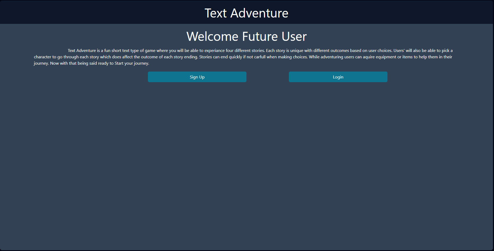

# Text_Adventure
## Description

Go on a thrilling text adventure where your goal is to explore, interact and discover new places and items. TIn this captivating game, we have seamlessly blended the elements of exploration, puzzle-solving, and decision-making to create an immersive and entertaining experience like no other. Our primary objective in developing this game was to provide you, the player, with a delightful and engaging user experience while simultaneously gaining valuable insights into the intricacies of full-stack applications and game development.

Developing this text adventure game came with many challenges as this is our first time developing a front and back end application. We used new APIs and frameworks that are new to us. Also timing how and when certain parts of the project would be done in order to advance another. As we continue to refine and expand our project, we strive to enhance its features and incorporate additional elements that will captivate and captivate players even further.

## Usage
1.) You start by either making an account or logging in.

2.) If you do not have an account you enter a username, email and password.
.png)
3.) Finally you log in and start your adventure!
.png)

## Credits

Collaborators:
Giovanne-Villanueva: [Github Profile](https://github.com/Giovanne-Villanueva)
Diana L: [Github Profile](https://github.com/dianalukove)
Angel Garcia: [Github Profile](https://github.com/angelg12345)
Aaron Styza: [Github Profile](https://github.com/ajstyza)

## License

Refer to the repo file for licensing information.

